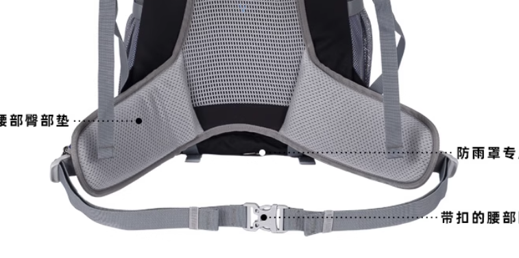

## 背包选择
无论对于轻装还是重装在高海拔, 都应该选择具有一定背负系统的背包, 勿使用如电脑包, 休闲包这类只有两条背带的包, 最次也应具有第三条, 固定的腰带, 这能将部分力传导到腰部以下, 减轻肩部压力.

> 重点注意: 瘦子在进行选择背包的时候, 不能将背负系统和品牌放在第一位, 而应该将背负舒适放在第一位, 不能人去适应背包, 本末倒置是不正确, 而应该在一开始就购买合适的背包
#### 背负舒适
长时间背负的时候, 肩部和胯部不应该感受到不适感
### 背包选择

#### 短途 (一日路线)

背负重量在5kg以上, 就需要额外的背负系统来减轻负担, 如图示例, 一大块厚实的腰封, 建议至少 7cm 宽, 带泡棉的腰封，能减轻肩膀负担 也能大部分重量传导到胯部上, 行走将更加轻松, 犹如像格里高利nano那种, 则不在推荐列表之列, 不同牌子的 S/M/L 尺码差别大，最好按背长挑选 
##### 推荐
* 200元带腰封的 **小容量(30L左右)** 国产背包: 艾王, 牧高笛, 挪客, 迪卡侬 (随便买)....
* 500元以上属于国际大牌: 
    1. Osprey Talon 22
    2. Deuter Speed Lite 24
    3. Gregory Zulu 30
    4. Osprey Stratos 26

#### 中等负重 (12kg)
随着负重的加大，原本软绵绵的腰封和背板，显得很勉强，无法将重量有效地传递到胯部。此时就需要更刚性、更贴合背型的背负系统，例如带有金属支架或硬质背板的款式，这类设计能让包身保持形状，从而在长时间行走中保持重量分配的稳定性
##### 对于中等负重的短途高海拔徒步，以下几点是重点

腰封支撑性：必须足够硬挺，能“抱住”胯部，而不仅仅是装饰性织带。

背板刚性：优选内置铝条或可调节背长的背板系统，确保包不会在负重时塌陷。

肩带形状：负重越大，肩带越要宽且有厚度，并且贴合锁骨区域，避免长时间摩擦造成压痛。

背长调节：不同身高和背长的人差别很大，可调节背长的设计能显著提高舒适度。
##### 推荐
* 国产性价比款（400~800 元）：牧高笛远征系列、探路者专业户外系列、凯乐石登山系列（需选高负重版）

* 国际品牌（1200 元以上）：

    1. Gregory Zulu 35 / Jade 33 — 腰封厚实且有预弯设计，长时间 12kg 负重依旧稳定

    2. Osprey Atmos AG 50 / Aura AG 50 — 经典全网面 Anti-Gravity 背负，舒适度极高

    3. Deuter Futura 32 — 背板刚性强，透气良好，适合高海拔长时间行走

#### 重装 (15kg 及以上)
当负重达到重装级别，背包的选择不仅是舒适问题，更是安全问题。此时需要具备全尺寸背负系统的背包，包括：

框架结构（铝合金或碳纤维骨架）

**腰封与背板是刚性连接(重要)**

**超宽厚腰封（10cm 以上,3cm 厚,包裹性强）**

可调节背长和**可调节位置的重力带(重要)**

多点压缩系统，防止装备在包内晃动

##### 推荐
* 国产 1000元左右
    1. 挪客氦70L, 经过笔者测试过
    2. 凯乐石巅峰carbon, 碳纤维背板, 厚实的腰封
* 国际品牌 2000以上
    1. Osprey 苍穹plus
    2. Gregory Baltoro pro